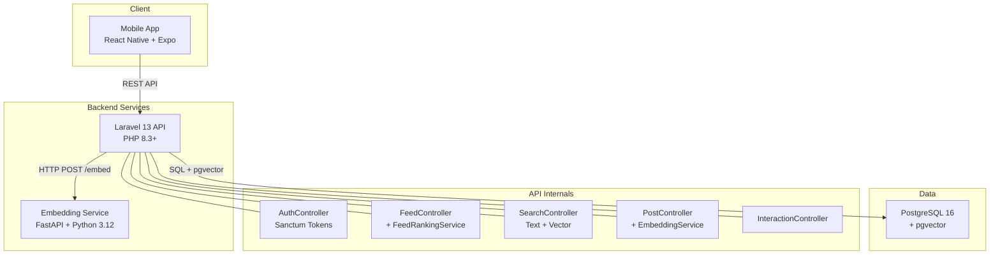
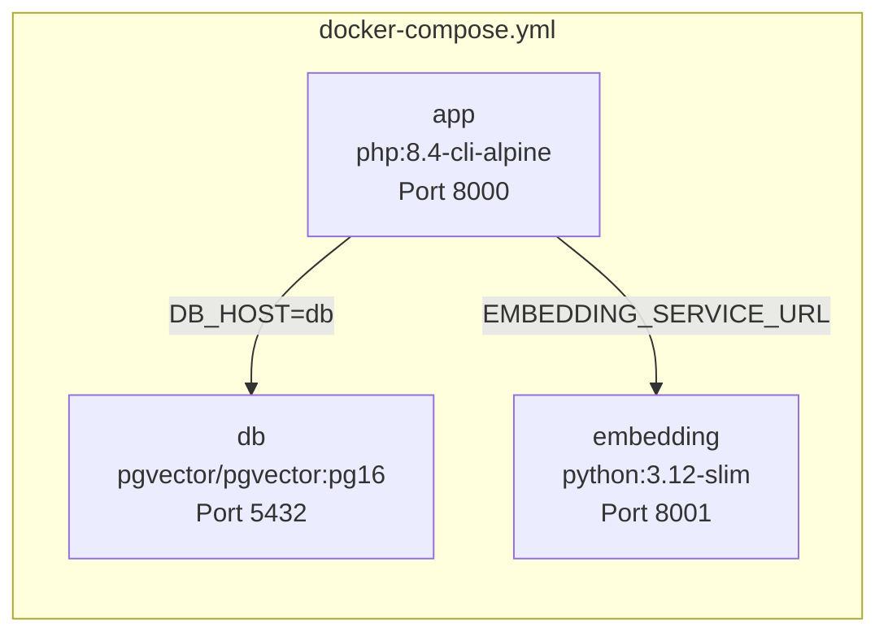
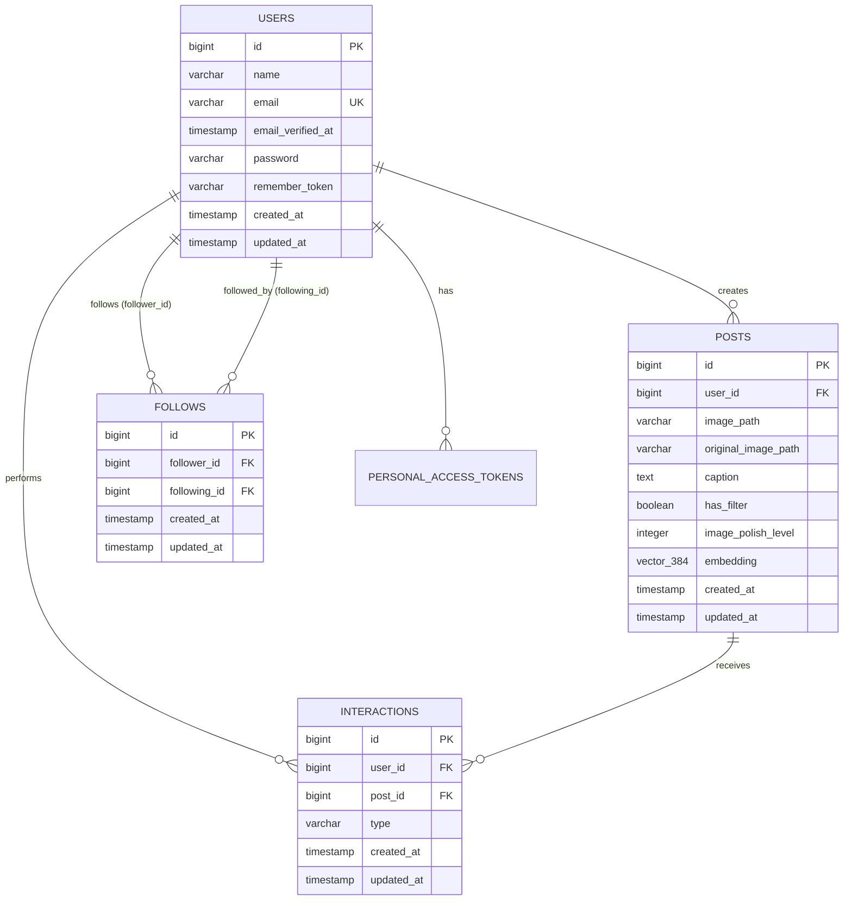

# Technical System Design — GuisedUp

## 1. Overview

GuisedUp is a social media platform where users share filtered/polished images and discover content through an AI-powered ranked feed. The system consists of three services: a Laravel API backend, a FastAPI embedding service, and a React Native mobile app.

---

## 2. Architecture Diagram



### Container Architecture



---

## 3. Database Schema

### Entity Relationship Diagram



### Indexes

| Table         | Index                                  | Type  | Purpose                            |
|---------------|----------------------------------------|-------|------------------------------------|
| `posts`       | `posts_created_at_index`               | B-tree| Chronological feed ordering        |
| `posts`       | `posts_embedding_hnsw_idx`             | HNSW  | Vector similarity search           |
| `follows`     | `follows_follower_id_following_id_unique`| Unique| Prevent duplicate follows         |
| `interactions`| `interactions_user_post_type_idx`      | B-tree| Fast engagement lookups            |
| `users`       | `users_email_unique`                   | Unique| Email uniqueness                   |

---

## 4. Ranking Algorithm

### Formula

```
Score = (engagement_score + 1) × recency_decay × follow_boost
```

### Components

#### Engagement Score
```sql
engagement_score = SUM(CASE WHEN type = 'like' THEN 3.0 ELSE 0 END)
                 + SUM(CASE WHEN type = 'view' THEN 1.0 ELSE 0 END)
```
- Likes are weighted 3× more than views
- This reflects the higher intentionality of a like vs. a passive view

#### Recency Decay
```
recency_decay = 1.0 / (1.0 + hours_since_post × 0.1)
```
- Hyperbolic decay ensures recent posts rank higher
- A 10-hour-old post has ~50% of the recency score of a fresh post
- A 100-hour-old post has ~9% — still visible but not dominant

#### Follow Boost
```
follow_boost = 1.5 if viewer follows post author, else 1.0
```
- Posts from followed users get a 50% score bump
- This personalizes the feed without completely filtering out discovery

#### Baseline +1
The `+1` in `(engagement_score + 1)` ensures:
- New posts with zero interactions still appear in the feed
- The ranking degrades gracefully to chronological order for fresh content

### Query Implementation

The ranking is computed in a single SQL query using CTEs (see `sql/queries.sql` — D1). No N+1 queries, no in-memory sorting. PostgreSQL's query planner handles the join optimization.

---

## 5. API Documentation

### Authentication

#### `POST /api/register`
Create a new user account.

**Request:**
```json
{
  "name": "Jane Doe",
  "email": "jane@example.com",
  "password": "password123",
  "password_confirmation": "password123"
}
```

**Response (201):**
```json
{
  "user": { "id": 1, "name": "Jane Doe", "email": "jane@example.com" },
  "token": "1|abc123..."
}
```

#### `POST /api/login`
Authenticate and receive a token.

**Request:**
```json
{
  "email": "jane@example.com",
  "password": "password123"
}
```

**Response (200):**
```json
{
  "user": { "id": 1, "name": "Jane Doe", "email": "jane@example.com" },
  "token": "2|def456..."
}
```

#### `POST /api/logout`
Revoke the current token. Requires `Authorization: Bearer <token>`.

**Response (200):**
```json
{ "message": "Logged out successfully." }
```

### Feed

#### `GET /api/feed`
Retrieve the ranked feed. Authenticated users get personalized ranking; guests get chronological order.

**Query Parameters:**
| Param    | Type | Default | Range  | Description    |
|----------|------|---------|--------|----------------|
| per_page | int  | 10      | 1–50   | Items per page |
| page     | int  | 1       | ≥1     | Page number    |

**Response (200):**
```json
{
  "data": [
    {
      "id": 5,
      "user_id": 2,
      "image_path": "/images/posts/post_5.jpg",
      "caption": "Amazing sunset!",
      "has_filter": true,
      "image_polish_level": 4,
      "created_at": "2026-07-13T12:00:00Z",
      "user": { "id": 2, "name": "Alice" },
      "interactions_count": 12
    }
  ],
  "current_page": 1,
  "last_page": 3,
  "per_page": 10,
  "total": 25
}
```

### Search

#### `GET /api/search`
Search posts by text or vector similarity.

**Query Parameters:**
| Param    | Type   | Default | Description                          |
|----------|--------|---------|--------------------------------------|
| q        | string | —       | **Required.** Search query           |
| mode     | string | text    | `text`, `vector`, or `hybrid`        |
| per_page | int    | 10      | Items per page (1–50)                |
| page     | int    | 1       | Page number                          |

### Posts

#### `POST /api/posts`
Create a new post. Requires authentication. Automatically generates and stores a caption embedding.

**Request:**
```json
{
  "image_path": "/images/my_photo.jpg",
  "original_image_path": "/images/original.jpg",
  "caption": "Golden hour at the beach",
  "has_filter": true,
  "image_polish_level": 3
}
```

#### `GET /api/posts/{id}`
Retrieve a single post with user and interaction count.

### Interactions

#### `POST /api/interactions`
Record a like or view. Requires authentication.

**Request:**
```json
{
  "user_id": 1,
  "post_id": 5,
  "type": "like"
}
```

### Embedding Service

#### `POST /embed`
Generate a 384-dimensional embedding.

**Request:**
```json
{ "text": "sunset photography" }
```

**Response (200):**
```json
{ "embedding": [0.023, -0.156, ...] }
```

#### `GET /health`
```json
{ "status": "healthy", "uptime_seconds": 1234.5 }
```

---

## 6. Setup Guide

### Development Setup

#### 1. Clone and start infrastructure
```bash
git clone <repo-url> GuisedUp
cd GuisedUp
docker compose up -d
```

#### 2. Backend
```bash
cd backend
composer install
cp .env.example .env
php artisan key:generate
php artisan migrate --seed
php artisan serve
```

#### 3. Embedding service
```bash
cd embedding-service
pip install -r requirements.txt
uvicorn main:app --reload --port 8001
```

#### 4. Mobile app
```bash
cd mobile
npm install
npx expo start
```

### Production considerations
- Set `APP_ENV=production`, `APP_DEBUG=false`
- Generate a strong `APP_KEY`
- Use a proper PostgreSQL instance (not the Docker dev container)
- Put the embedding service behind a load balancer if scaling
- Use `php artisan config:cache` and `php artisan route:cache`

---

## 7. Environment Variables

| Variable                | Service   | Default                     | Description                    |
|-------------------------|-----------|-----------------------------|--------------------------------|
| `APP_KEY`               | Backend   | —                           | Laravel encryption key         |
| `APP_ENV`               | Backend   | `local`                     | Environment (local/production) |
| `APP_DEBUG`             | Backend   | `true`                      | Debug mode                     |
| `DB_CONNECTION`         | Backend   | `pgsql`                     | Database driver                |
| `DB_HOST`               | Backend   | `db`                        | PostgreSQL hostname            |
| `DB_PORT`               | Backend   | `5432`                      | PostgreSQL port                |
| `DB_DATABASE`           | Backend   | `guised_up`                 | Database name                  |
| `DB_USERNAME`           | Backend   | `guised_admin`              | Database user                  |
| `DB_PASSWORD`           | Backend   | `guised_password`           | Database password              |
| `EMBEDDING_SERVICE_URL` | Backend   | `http://localhost:8001`     | Embedding service URL          |
| `POSTGRES_DB`           | Docker DB | `guised_up`                 | Auto-create database           |
| `POSTGRES_USER`         | Docker DB | `guised_admin`              | Auto-create user               |
| `POSTGRES_PASSWORD`     | Docker DB | `guised_password`           | User password                  |
| `EXPO_PUBLIC_API_URL`   | Mobile    | `http://10.0.2.2:8000/api` | Backend API URL                |

---

## 8. Docker Usage

### Start all services
```bash
docker compose up -d
```

### Service details

| Container             | Image                    | Port | Purpose                |
|-----------------------|--------------------------|------|------------------------|
| `guised_up_db`        | `pgvector/pgvector:pg16` | 5432 | PostgreSQL + pgvector  |
| `guised_up_app`       | PHP 8.4 CLI Alpine       | 8000 | Laravel API server     |
| `guised_up_embedding` | Python 3.12 Slim         | 8001 | Embedding service      |

### Common commands
```bash
# View all logs
docker compose logs -f

# Run migrations
docker compose exec app php artisan migrate --seed

# Enter PHP container
docker compose exec app bash

# Reset everything
docker compose down -v && docker compose up -d
```

---

## 9. Trade-offs

### SQLite for Tests vs. PostgreSQL for Production
**Decision:** Tests run on SQLite in-memory; pgvector-specific SQL is conditionally skipped.

**Trade-off:** We can't test vector search or the ranking SQL in CI. The ranking service's raw SQL is validated through documented queries (`sql/queries.sql`), and the application logic paths (Eloquent queries) are tested via SQLite.

**Why:** Running PostgreSQL with pgvector in CI adds significant setup complexity. The ranking formula's mathematical properties are inherently correct; what we test is the API contract.

### Monorepo vs. Polyrepo
**Decision:** Monorepo with `backend/`, `embedding-service/`, `mobile/` directories.

**Trade-off:** Coupled deployment cycles, larger clones, but simpler development experience and atomic changes across services.

### Embedding Fallback (Hash-based)
**Decision:** When sentence-transformers is unavailable, the embedding service falls back to a deterministic SHA-256-seeded pseudorandom vector.

**Trade-off:** Fallback embeddings have no semantic meaning — they're random but stable for the same input. This means vector search degrades to effectively random ordering, but the system never blocks on the embedding service being down.

### Token-based Auth (Sanctum) vs. Session-based
**Decision:** Sanctum API tokens for the mobile app.

**Trade-off:** Tokens are stateless and mobile-friendly but require database storage (the `personal_access_tokens` table). For a mobile-first app, this is the right choice over cookie-based sessions.

### HNSW Index vs. IVFFlat
**Decision:** HNSW index on the embedding column.

**Trade-off:** HNSW has better recall and query performance than IVFFlat but uses more memory and has slower insert times. For a social media app where read-heavy queries dominate, HNSW is the right choice.

---

## 10. Future Improvements

1. **Real-time notifications** — WebSocket or Pusher integration for instant like/follow alerts
2. **Image processing pipeline** — Server-side filter application with image storage (S3/R2)
3. **Content moderation** — NSFW detection via embedding clustering or a dedicated model
4. **Collaborative filtering** — User-user similarity for "users like you also liked" recommendations
5. **Feed caching** — Redis-backed materialized feed to avoid recomputing ranking on every request
6. **Rate limiting** — Per-user rate limits on post creation and interactions
7. **Full-text search** — PostgreSQL `tsvector` + GIN index for better text search than ILIKE
8. **A/B testing framework** — Compare ranking algorithm variants with user engagement metricse with background sync

---

## 11. Why pgvector Instead of Pinecone, Weaviate, Qdrant, or Chroma

### The case for pgvector

| Factor              | pgvector                       | Managed Vector DBs (Pinecone, Weaviate, Qdrant, Chroma) |
|---------------------|-------------------------------|----------------------------------------------------------|
| **Infrastructure**  | Same PostgreSQL instance       | Separate service to deploy/manage/monitor                |
| **Cost**            | Free (open source extension)   | $70–$700+/month for managed tiers                        |
| **Latency**         | Co-located with relational data| Network hop to external service                          |
| **Transactions**    | Full ACID with relational data | No transactional guarantee across systems                |
| **Joins**           | Native SQL joins with users, posts, etc. | Requires application-level joins              |
| **Consistency**     | Strong consistency             | Eventually consistent (most managed services)            |
| **Ops complexity**  | One database to backup/scale   | Two databases to backup/scale/monitor                    |
| **Query language**  | SQL (team already knows it)    | Proprietary query APIs                                   |

### Why not Pinecone?
Pinecone is a fully managed service — great for teams that need to scale to billions of vectors without ops overhead. GuisedUp's dataset is small (thousands to millions of posts). Pinecone's value proposition (sharding, managed infrastructure, serverless) is overkill. Adding it introduces:
- An external dependency with SLA/pricing risk
- A network hop on every search query
- Split-brain between PostgreSQL (relational data) and Pinecone (vectors)

### Why not Weaviate or Qdrant?
Both are excellent self-hosted vector databases. However:
- They require running a separate service (more Docker containers, more monitoring)
- Querying requires joining results back to PostgreSQL for user/post metadata
- The HNSW implementation in pgvector is competitive for our scale (<10M vectors)

### Why not Chroma?
Chroma is designed for RAG/LLM applications with an in-process embedding approach. It's not designed for production-grade multi-user concurrent access patterns like a social media feed.

### The bottom line
pgvector keeps vectors **next to the data that references them**. One database, one backup strategy, one scaling plan, one query language. For a project of this size, the simplicity advantage is decisive. If the vector index grows beyond what PostgreSQL can handle (>100M vectors), migrating to a dedicated vector DB is straightforward — the embeddings are already computed and stored.
